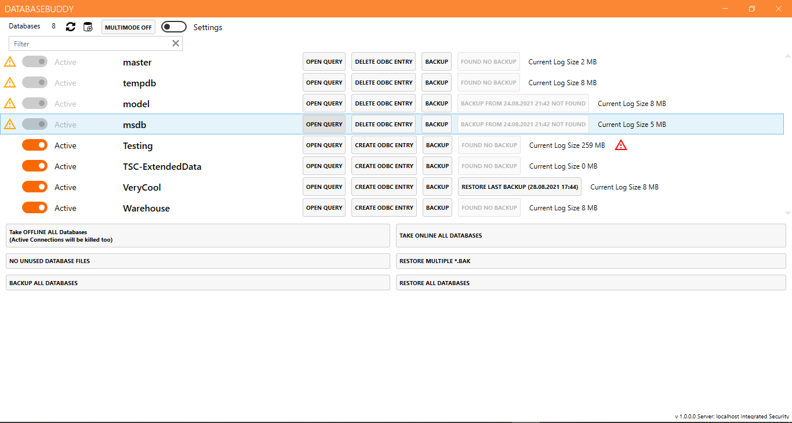
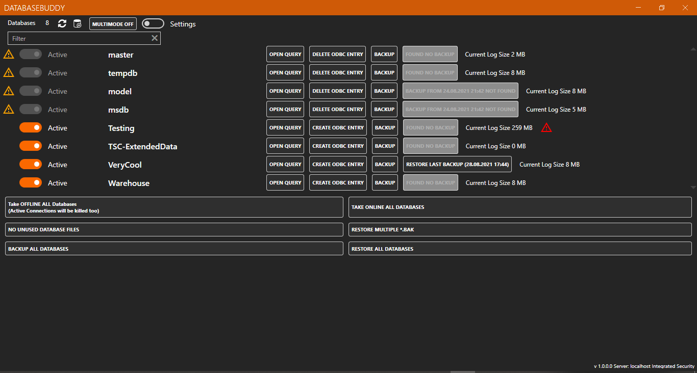
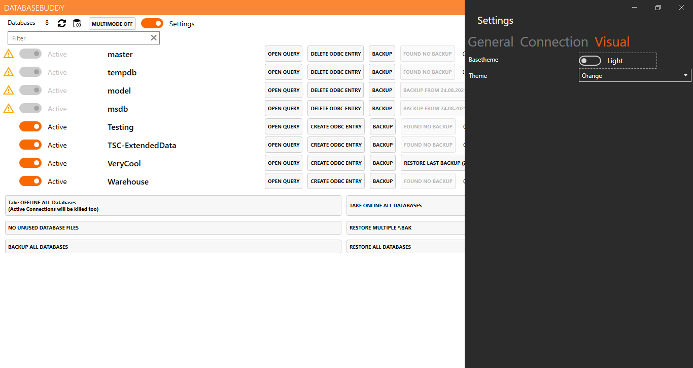
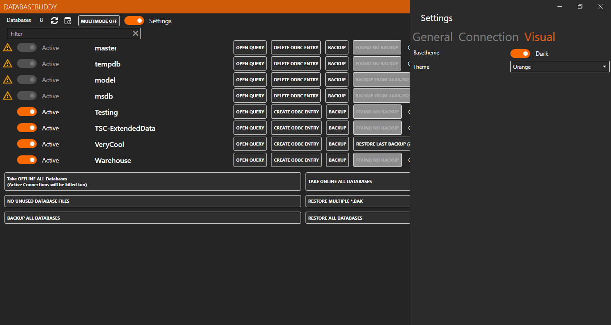

# DatabaseBuddy v0.1

Database Buddy is a simple database management created by two \
software development trainees from Germany.

# Features
- List all databases on a Microsoft SQL Server
- Take on-/offline one or all server with one click
- Backup single / multiselected / all databases with one click
- Restore single / multiselected / all databases with one click
- Rename database
- Clone single / all database
- Restart Micorosft SQL Server
- Create new database
- Open database / backup containing folder
- Tracking database log file sizes
- Delete unused database files
- Restore single / multiselected databases from *.bak files
- Delete database

# Download

# Screenshots

